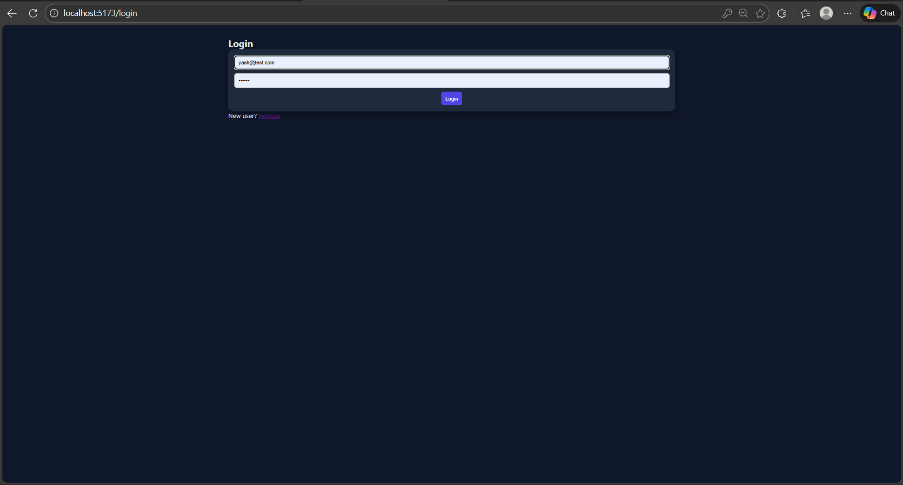
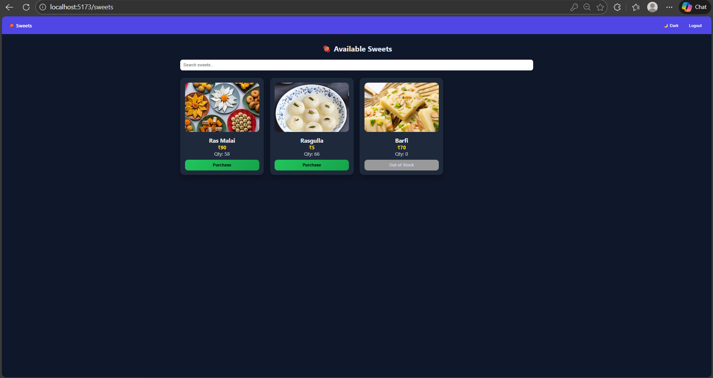
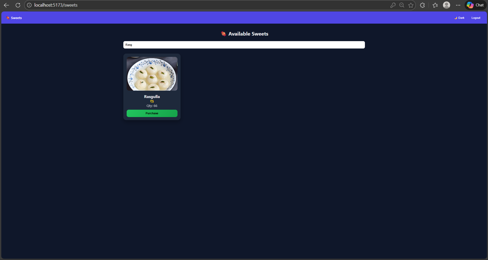

# 🍬 Sweet Shop Management System

A full-stack **Sweet Shop Management System** built using **Node.js, Express, MongoDB, React, and TypeScript**.
This project demonstrates backend API design, authentication, inventory management, frontend UI development, and clean coding practices following **Test-Driven Development (TDD)** principles.

---

## 📌 Project Overview

The Sweet Shop Management System allows users to:

* Register and log in securely
* Browse available sweets
* Search and filter sweets by name, category, or price
* Purchase sweets (with real-time inventory updates)

Admin users can additionally:

* Add new sweets
* Update sweet details
* Restock inventory
* Delete sweets

The system uses **JWT-based authentication** to protect sensitive routes and enforce role-based access control.

---

## 🛠️ Tech Stack

### Backend

* **Node.js**
* **Express.js**
* **TypeScript**
* **MongoDB** (with Mongoose)
* **JWT Authentication**
* **bcryptjs** (password hashing)

### Frontend

* **React** (Vite)
* **TypeScript**
* **Axios**
* **CSS / Tailwind-inspired styling**

### Testing

* **Jest** (backend unit & integration tests)

---

## 🔐 Authentication & Authorization

* Users can **register** and **log in**
* JWT tokens are issued on login
* Protected routes require a valid token
* Role-based access:

  * **USER** → purchase sweets
  * **ADMIN** → add, update, restock, delete sweets

---

## 📡 API Endpoints

### Auth

* `POST /api/auth/register` → Register a new user
* `POST /api/auth/login` → Login and receive JWT

### Sweets (Protected)

* `POST /api/sweets` → Add a new sweet (Admin)
* `GET /api/sweets` → Get all sweets
* `GET /api/sweets/search` → Search sweets
* `PUT /api/sweets/:id` → Update sweet details (Admin)
* `DELETE /api/sweets/:id` → Delete a sweet (Admin)

### Inventory

* `POST /api/sweets/:id/purchase` → Purchase a sweet (User)
* `POST /api/sweets/:id/restock` → Restock sweet (Admin)

Each sweet contains:

* `id`
* `name`
* `category`
* `price`
* `quantity`

---

## 🖥️ Frontend Features

* Login & Registration forms
* Sweet listing dashboard
* Search & filter UI
* Purchase button (disabled when out of stock)
* Admin dashboard for inventory management
* Sweet images auto-mapped by sweet name
* Dark mode UI
* Toast notifications for actions

---

## ⚙️ Local Setup Instructions

### 1️⃣ Clone the repository

```bash
git clone https://github.com/yash5180/sweet-shop-management-system.git
cd sweet-shop-management-system
```

---

### 2️⃣ Backend Setup

```bash
cd backend
npm install
```

Create a `.env` file:

```env
PORT=5001
MONGO_URI=mongodb://localhost:27017/sweetshop
JWT_SECRET=my_super_secret_key
```

Run backend server:

```bash
npm run dev
```

---

### 3️⃣ Frontend Setup

```bash
cd frontend
npm install
npm run dev
```

Frontend runs at:

```
http://localhost:5173
```

---

## 🧪 Testing (TDD)

* Tests were written before implementing core backend logic
* Followed **Red → Green → Refactor** cycle
* Covers authentication, sweet inventory logic, and edge cases

To run tests:

```bash
cd backend
npm test
```

---

## 📸 Screenshots

### 🔐 Login Page


### 📝 Registration Page


### 🍬 User Dashboard – Available Sweets


### 🔍 Search & Filter Functionality


### 🛠️ Admin Dashboard


---

## 🤖 My AI Usage

I actively used AI tools during development to enhance productivity and code quality.

### Tools Used

* **ChatGPT**

### How I Used AI

* Generated initial boilerplate for backend controllers and middleware
* Helped debug JWT authentication and CORS issues
* Assisted in designing REST API structure
* Improved frontend UI logic and state management
* Helped structure README documentation

### Reflection

AI significantly accelerated development and helped debug complex issues faster.
However, all logic was reviewed, understood, and customized manually to ensure correctness and originality.

---

## 📄 License

This project is provided for educational and evaluation purposes.

---

## 👤 Author

**Yash Arora**
GitHub: [https://github.com/yash5180](https://github.com/yash5180)

---

✨ *Feel free to star the repository if you like it!*
